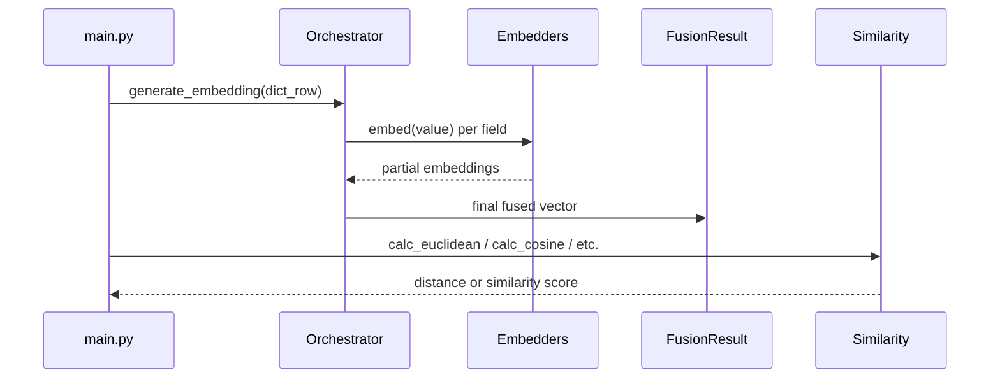

# Multi-Modal Fusion Embedding System

## Introduction

Many modern applications require **embedding** diverse data (text, numeric, categorical, etc.) into a **single vector**—often referred to as a **fusion vector**. This unified representation enables advanced similarity searches, recommendations, and analytics over heterogeneous data sources.

In this project, we’ve built a **multi-step pipeline** that:

1. **Pulls data** from a source (e.g., Snowflake or JSON inputs).
2. **Embeds** each field via a specialized approach (text embeddings, numeric normalization, or category embeddings).
3. **Fuses** those embeddings into a single vector.
4. **Enables** easy **distance/similarity** computations among those vectors.

## Problem Domain

- **Data Heterogeneity**: Real-world entities (users, products, transactions) often span multiple **modalities** (textual descriptions, numeric counts, categories).
- **Unified Embedding**: We want to combine these diverse features into a **single numeric vector** to facilitate similarity-based tasks (e.g., “Which user states are closest in behavior?”).
- **Scalability & Extensibility**: We aim for a system that can easily integrate new data types (e.g., images, geospatial) and new embedding techniques (e.g., OpenAI, Hugging Face).

## What We’re Trying to Accomplish

1. **Generate a Fusion Vector** per record (or JSON object) by applying the appropriate embedder to each field.
2. **Compute Similarities** (or distances) among fused vectors to quantify how “close” or “far” different entities are in embedding space.
3. **Remain Flexible** so the system can:
   - Switch embedding providers (OpenAI vs. Hugging Face).
   - Plug in new normalization or category-handling methods.
   - Integrate with real databases (Snowflake) or direct JSON input.

## Major Components

Below is a **high-level overview** of each main file and its responsibility.

### 1. `appconfig.py`

- **Purpose**: Loads environment variables (e.g., from a `.env` file) using `python-dotenv`.
- **Example**: Contains Snowflake credentials and OpenAI API keys.

### 2. `database.py`

- **Purpose**: Demonstrates how to connect to a Snowflake database.
- **Methods**:
  - `get_schema_info(table_name)`: Inspect column names and data types.
  - `get_records(table_name, limit)`: Fetch rows as a list of dictionaries.

### 3. `embedding.py`

- **Purpose**: Defines **abstract bases** (`EmbeddingBase`, `TextEmbedderBase`) and **specific** embedders:
  - **OpenAITextEmbedder**: Calls OpenAI’s Embedding API (e.g., `text-embedding-ada-002`).
  - **NumericEmbedder**: Min–max normalizes numbers into [0,1].
  - **CategoryEmbedder**: One-hot encodes categorical values.
- **EmbeddingFactory**: Creates a `TextEmbedder` instance based on config (`openai` vs. `huggingface`).

### 4. `embedding_orchestrator.py`

- **Purpose**: The **fusion logic**.
- **Key Class**: `EmbeddingOrchestrator` takes a record (dict), consults `field_type_map` to decide which embedder to use for each field, and **concatenates** the results into one fused vector.

### 5. `fusion_result.py`

- **Purpose**: Holds the **result** of the fusion process:
  - `original_data`: The original dict/JSON object.
  - `component_embeddings`: A per-field map of embeddings.
  - `fusion_embedding`: The final fused vector.

### 6. `similarity.py`

- **Purpose**: Houses **distance** and **similarity** methods:
  - `calc_euclidean()`
  - `calc_manhattan()`
  - `calc_cosine()`
- **Usage**: Compare two fused vectors (e.g., from two records).

### 7. `main.py`

- **Purpose**: A **driver script** to demonstrate:
  1. Loading config.
  2. Creating or retrieving data (e.g., from Snowflake or local JSON).
  3. Generating `FusionResult` objects using `EmbeddingOrchestrator`.
  4. Optionally calling `Similarity` methods to compare vectors.

## Flow Overview

Below is a **Mermaid sequence diagram** showing how the system handles a row (or JSON dict) and computes similarities:



1. **`main.py`** calls `generate_embedding` with a single-level dict.
2. **`EmbeddingOrchestrator`** dispatches each field to the corresponding embedder.
3. **Embedders** produce partial vectors (text, numeric, or category).
4. **`EmbeddingOrchestrator`** concatenates them into a final fused vector, wrapped in a `FusionResult`.
5. Finally, `main.py` uses **`Similarity`** to compute a distance or similarity metric among any fused vectors.

## Installation Instructions

1. **Clone** this repository or copy the files to your local environment.
2. **Create** a virtual environment (recommended):
   ```bash
   python3 -m venv venv
   source venv/bin/activate
   ```
3. **Install** dependencies from `requirements.txt`:
   ```bash
   pip install -r requirements.txt
   ```
   - Make sure `numpy` is included if you plan on using Cosine similarity from `similarity.py`.
4. **Set up** a `.env` file for credentials (OpenAI, Snowflake, etc.). Example:

   ```env
   OPENAI_API_KEY=sk-1234abcd
   OPENAI_MODEL_NAME=text-embedding-ada-002
   OPENAI_PROVIDER=openai

   SNOWFLAKE_ACCOUNT=xyz12345.us-east-1
   SNOWFLAKE_USER=myuser
   SNOWFLAKE_PASSWORD=secret
   SNOWFLAKE_WAREHOUSE=COMPUTE_WH
   SNOWFLAKE_DATABASE=MY_DB
   SNOWFLAKE_SCHEMA=PUBLIC
   ```

5. **Run** the example script:
   ```bash
   python main.py
   ```
   - This will embed your user data (or any JSON objects) and print both partial embeddings and final fused vectors.
   - You can also see distance/similarity calculations for demonstration.

---

**That’s it!** You now have a flexible, multi-modal embedding system that can:

- **Embed** text, numeric, and categorical data into a single fusion vector.
- **Compute** similarity or distance between fused vectors.
- **Easily** integrate with real databases or pure JSON data for advanced search and analysis.
